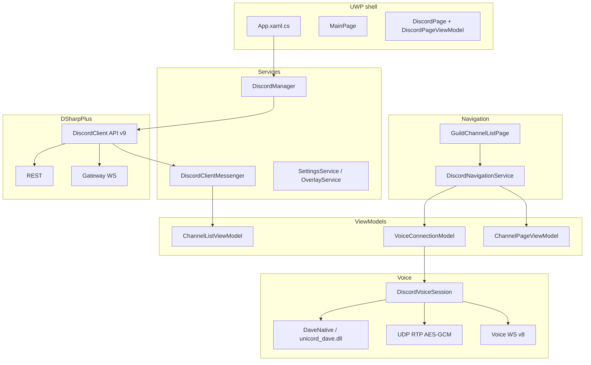

---
tags:
  - "#architecture"
  - index
aliases:
  - Architecture
---

# 02 — Architecture Overview

## Layer Diagram



## Data Flow

### Startup / login
```
App launch
  → DiscordManager.KickoffConnectionAsync / LoginAsync
  → PasswordVault token (Constants.TOKEN_IDENTIFIER / "Default")
  → new DiscordClient { TokenType = User }
  → DiscordClientMessenger.Register
  → ConnectAsync
  → Ready → UI leaves connecting overlay
```

### Text channel navigation
```
GuildChannelListPage.SelectionChanged
  → DiscordNavigationService.NavigateAsync(channel)
  → MainFrame → ChannelPage / Forum / AgeGate
  → DiscordPageViewModel.CurrentChannel
```

### Voice channel navigation
```
Same list: voice row is not kept selected
  → NavigateAsync(voice channel)
  → if VoiceModel != null: DisconnectAsync (leave + wait)
  → new VoiceConnectionModel(channel)
  → ConnectAsync (join handshake + DiscordVoiceSession)
```

### Gateway events → UI
```
DiscordClient event
  → DiscordClientMessenger
  → WeakReferenceMessenger.Default.Send
  → ChannelListViewModel / other VMs
```

## Ownership

| State | Owner | Notes |
|-------|-------|-------|
| DiscordClient instance | `DiscordManager` | Static; one live client |
| User token | Windows PasswordVault | Never log or commit |
| Current text channel | `DiscordPageViewModel` | Navigation service writes it |
| Voice connection | `DiscordPageViewModel.VoiceModel` | One guild voice at a time |
| Voice session_id / token / endpoint | `VoiceConnectionModel` | Latest pair; stay subscribed |
| Voice WS / UDP / DAVE | `DiscordVoiceSession` | In-process (not AppService) |
| Channel voice members | DSharpPlus `Guild._voiceStates` + `Channel.Users` | UI via `ChannelListViewModel.VoiceMembers` |

## Obsolete path (do not revive)

`Unicord.Universal.Voice` native AppService (package 1.0.2) spoke voice **WS v5** and **xsalsa20**. Discord dropped that. Current audio is **in-process** C# + `unicord_dave.dll`.

---

## Links
- [[Clean Architecture]]
- [[Voice Handshake]]
- [[Navigation]]
